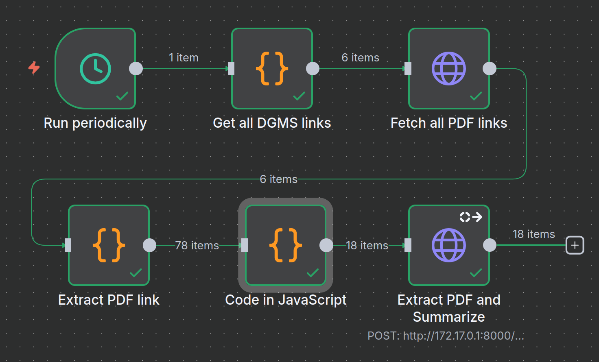

# MineSafe: AI-Powered Mining Safety Intelligence Platform

### Team `&nbsp;`
- Rahul Joshi	(Web Dev)
- Rachit Kumar Pandey (n8n)
- Sanjib Behera (RAG)
- Mohammad Abbas Mehdi (Web Dev)
- Shubhomoy Dey (AI/ML)

---

## Overview

**MineSafe** is an AI-driven safety intelligence platform designed to enhance transparency, compliance, and awareness in the mining industry.
Our solution automates the monitoring, analysis, and dissemination of critical mining safety data from the **Directorate General of Mines Safety (DGMS)** and related sources enabling faster response, improved reporting, and informed decision-making.

---

## Key Components

### 1. Automated DGMS Data Pipeline (n8n)

* **Built with n8n**, an open-source automation tool.
* Periodically scans **DGMS websites** for:

  * Circulars
  * Safety Notifications
  * Incident Reports
  * Accident Summaries
* Extracted data is cleaned, structured, and stored for downstream AI processing.

---

### 2. AI-Powered Audit Report Generation

* Uses **Generative AI** to create detailed **safety audit reports** from raw DGMS data.
* Each report includes:

  * Summary of key incidents
  * Root cause analysis
  * Recommendations & preventive measures
* Reports are auto-published to a centralized dashboard for easy access.

---

### 3. Interactive Dashboard

* Web-based dashboard displaying:

  * **Accident statistics** by region, mine type, and cause
  * **Time-series analysis** for trend identification
  * **Compliance metrics** and generated audit reports
* Built for decision-makers and safety officers to monitor real-time data.

---

### 4. “Safety Officer AI”

* **AI chatbot** designed to answer mining safety queries in natural language.
* Supports **Hindi voice-to-text input** for accessibility in field environments.
* Provides instant responses on:

  * Safety protocols
  * Emergency procedures
  * Latest DGMS circulars
  * Best practices and preventive guidelines

---

## 🧩 Tech Stack

| Layer                           | Technology                    |
| ------------------------------- | ----------------------------- |
| **Automation & Data Ingestion** | n8n                           |
| **Backend**                     | FastAPI / Node.js             |
| **AI & NLP**                    | Gemini / OpenAI Models        |
| **Dashboard**                   | Next.js + Chart.js / Recharts |
| **Database**                    | PostgreSQL / Supabase         |
| **Voice Processing**            | Google Speech-to-Text (Hindi) |
| **Deployment**                  | Docker + Render / Railway     |

---

## Impact

* **Faster insights** into mining incidents and safety trends.
* **Reduced manual workload** for audit officers and inspectors.
* **Accessible AI safety assistant** for workers in Hindi.
* **Data-driven decision-making** to improve mining safety culture.

---

